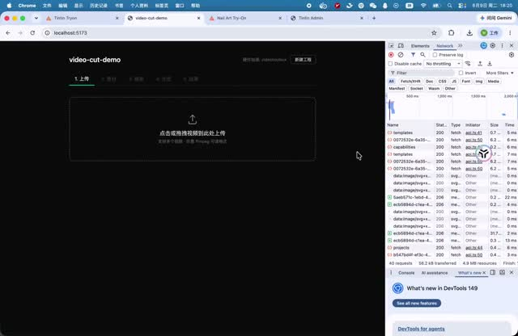

# video-cut-demo

面向**非专业用户**的本地自动视频混剪工具。上传视频 → 自动分割素材 → 选混剪模板 → ffmpeg 拼接出片 →（可选 AI 优化 / 自动字幕）→ 预览下载。全程本地可跑、可调试，AI 等重依赖一律可选且自动降级。

**🎬 演示视频**（点击封面播放）：

[](./demo.mp4)

> 架构与详设：[`docs/DESIGN.md`](docs/DESIGN.md)　·　开发进度：[`docs/PROGRESS.md`](docs/PROGRESS.md)

---

## 目录

- [功能特性](#功能特性)
- [技术栈与架构](#技术栈与架构)
- [视频主流程（核心）](#视频主流程核心)
- [混剪模板原理](#混剪模板原理)
- [目录结构](#目录结构)
- [本地开发启动](#本地开发启动)
- [Docker 部署](#docker-部署)
- [配置项 .env](#配置项-env)
- [可选能力与降级](#可选能力与降级)
- [数据与数据库迁移](#数据与数据库迁移)
- [API 速览](#api-速览)
- [已知限制](#已知限制)

---

## 功能特性

- **自动分割素材**：场景检测把源视频切成可用片段(clips)，每段给出缩略图与高光评分。
- **5 套混剪模板**：高光混剪 / POV 文案 / 剧情对话 / 人物混剪 / 悬念引流。
- **卡点混剪**：检测 BGM 节拍，镜头切点吸附到节拍上。
- **多画幅**：9:16、3:4、原始比例（裁切 / 填充 / 模糊填充）。
- **大字标题**：位置、时长、字号、颜色可调，带淡入动画。
- **音频混合**：配乐 + 原声混合，两路音量独立可调；或仅配乐 / 仅原声。
- **自动字幕**（可选）：语音识别生成字幕并烧录；**在混入音乐之前用纯人声识别**，避免音乐干扰。
- **AI 智能优化**（可选）：用大模型按意图重排镜头；provider 无关（OpenAI/Gemini/DeepSeek…）。
- **素材管理**：拖拽排序、勾选取舍、时间轴预览、单片段下载、素材删除。
- **结果管理**：预计时长前置展示、历史结果切换、可调配置重新生成、配置记忆。

---

## 技术栈与架构

| 层 | 选型 | 说明 |
|---|---|---|
| 前端 | Vite + React + TS + Tailwind v4 + Radix | 向导式 UI（`apps/web`） |
| 编排后端 | Node + Hono + 内置 `node:sqlite` | 状态/队列/模板引擎/AI/SSE（`apps/api`） |
| ffmpeg 执行 | Go + Gin 微服务 | 进程池、并发出片、`-progress` 进度（`svc/render`） |
| 语音识别 | faster-whisper（Docker） | 可选字幕（`svc/asr`） |
| 契约 | Zod（`packages/shared`） | `RenderSpec` / `Clip` / `Template` / `Job` 等跨服务类型 |
| 持久化 | SQLite + 版本化迁移（`packages/db`） | 零原生依赖、只进不退的增量迁移 |
| Monorepo | pnpm workspaces + Turborepo | — |

```
┌─────────────────────────────────────────────────────────┐
│  web (Vite/React)  上传·素材·模板·进度·结果               │
└───────────────▲───────────────────────┬──────────────────┘
                │ REST + SSE             │ /api 反代
┌───────────────┴───────────────────────▼──────────────────┐
│  api (Hono)  编排大脑                                      │
│  • 工程/素材/clip/作业 状态机 (SQLite + 版本化迁移)         │
│  • 内置作业队列 + worker(顺序执行, 崩溃可恢复)             │
│  • 模板引擎: 模板 + 分析结果 → RenderSpec(JSON)            │
│  • AI 优化(可选) / ASR→ASS(可选) / SSE 进度                │
└──────┬───────────────────────────────────┬───────────────┘
       │ HTTP(RenderSpec 等)                │ HTTP(可选)
┌──────▼─────────────────────┐   ┌──────────▼──────────────┐
│ render (Go + Gin)          │   │ asr (faster-whisper)    │
│ probe/thumbnail/scene/beat │   │ /asr 语音→文本+时间戳   │
│ clip/render/burnsub/       │   │ 不在则字幕降级跳过      │
│ speech-track/extract-audio │   └─────────────────────────┘
│ ffmpeg -progress → 回调进度 │
└────────────────────────────┘   api 与 render 共享 ./data 卷
```

**为什么这么分**：ffmpeg 重活独立成 Go 微服务，崩溃/吃满 CPU 不拖垮编排层，也能并发出片；本地开发 render 直跑宿主机还能用 VideoToolbox 硬件加速。api 用 Node 是为了和前端共享 TS 类型、AI/SDK 生态最全。

---

## 视频主流程（核心）

一次完整出片的**严格次序**，每步都是一个后台作业(job)，前端通过 SSE 看进度：

```
1. 上传      web 上传 → api 落盘 data/media/<id>.<ext> → 建 source 记录
                ↓ 入队 job(probe)
2. 探测      render /probe (ffprobe) → 回填时长/分辨率/帧率/编码/有无音轨
                → render /thumbnail 抽封面 → source.thumb_path
                （此时前端已能预览原视频 + 信息）
                ↓ 入队 job(segment)
3. 自动分割  render /scene (ffmpeg scdet 场景检测) → 得到场景切点
                → 由切点切出 clip 时间区间(过长再按上限切, 无切点则定长分块)
                → 每个 clip: render /thumbnail 抽缩略图
4. 高光评分  对每个 clip 计算启发式分数(无 AI、零额外 ffmpeg):
                score = 0.55·时长甜区(~2s) + 0.35·场景密度 + 0.1·确定性抖动
                → 写入 clips 表(可在素材页拖拽排序/勾选取舍)
   ── 用户在「模板」步骤选: 模板 + 画幅 + 配乐/混音 + 字幕 + 标题样式 ──
5. 节拍(可选) 若启用配乐且模板为卡点: render /beat (aubio) → 节拍时间戳数组
6. 编译      api 模板引擎 compile(): 把「模板 + 选用clips + 节拍」编译成 RenderSpec
                • 选段: 按模板策略(高分/顺序/有语音/钩子优先…)挑 clip
                • 节奏: 每镜头目标时长(模板设定), 卡点时吸附到整数个节拍
                • 转场: 有配乐且非混原声 → xfade; 否则硬切 concat
                • 文字: 大字标题(drawtext) + 字幕占位(后续填)
                • 音频: 仅配乐 / 配乐+原声(amix) / 仅原声
                （可选 AI: 把 RenderSpec 交给大模型按意图重排镜头）
                ↓ 入队 job(render)
7. 渲染      render /render: 把 RenderSpec 编译成 ffmpeg -filter_complex 出片
                • 每段: setpts(变速)→fps→画幅适配(crop/pad/blur_pad)→[v_i]
                • 拼接: xfade 链(offset 累计) 或 concat
                • 文字: drawtext 大字标题 + (可选)ass 字幕
                • 音频: 按上面的音频模式 amix/concat/bgm
                • 编码: h264_videotoolbox(宿主机) 或 libx264(容器)
                • -progress 实时回调 api → SSE → 前端进度条
                → 生成 data/out/<renderId>.mp4 + 结果缩略图
8. 字幕(可选) 渲染完成后异步: render /speech-track 产出「与成片对齐的纯人声 wav」
                → asr /asr 识别(混音前的干净人声) → 生成 ASS
                → render /burnsub 把字幕烧到成片 → 替换为 <renderId>-sub.mp4
9. 结果      结果页: 标题 / 模板引用 / 画幅 / 总时长 / 预览 / 下载 / 重新生成
```

> 关键点：**字幕识别发生在"混入背景音乐之前"**（第 8 步用 `/speech-track` 取剪辑后的纯原声），所以加了 BGM 也不会干扰识别；字幕时间轴与成片对齐。

---

## 混剪模板原理

模板是**声明式**的（`apps/api/src/templates.ts`），把"怎么剪"拆成四要素，编译器 `compile()` 是纯函数：

- **选段 selection**：`top_score`(按高光分) / `sequential`(按顺序) / `has_speech`(有语音段) / `has_face`(主体, v1 用启发式) / `hook_first`(最强片段开头)。
- **节奏 pacing**：`fixed`(固定镜头长) 或 `beat_sync`(吸附节拍)。每镜头目标时长由模板设定(如高光 ~1.4s)，卡点时取最接近该时长的整数个节拍间隔，保证既卡点又是可看的镜头长度。
- **风格 style**：转场类型(dissolve/fade/slide…)与时长、大字标题位置。
- **音频 audio**：是否用配乐、是否压低原声。用户在 UI 选的混音模式优先于模板默认。

| 模板 | 选段 | 节奏 | 适用 |
|---|---|---|---|
| 高光混剪 | 高分 top-K | 卡点中速 | 精彩集锦 |
| POV 文案 | 顺序 | 慢 | 氛围/文案向 |
| 剧情对话 | 有语音段、按时序 | 跟语音 | 口播/对话（字幕最连贯）|
| 人物混剪 | 主体优先 | 卡点中速 | 人物向 |
| 悬念引流 | 最强片段开头 | 前快后留白 | 引流钩子 |

编译产物 `RenderSpec` 是 api 与 render 之间的核心契约（Zod 定义于 `packages/shared`），渲染引擎无关，便于将来替换/扩展。

---

## 目录结构

```
apps/web         前端(Vite/React)
apps/api         Hono 编排 API + SQLite + 队列 + 模板引擎 + AI/ASR 客户端
svc/render       Go ffmpeg 微服务(probe/scene/beat/render/burnsub/speech-track…)
packages/shared  跨服务 Zod 契约(RenderSpec / Clip / Template / Job …)
packages/db      SQLite schema + 版本化迁移
scripts/         start.sh / stop.sh 一键起停
docs/            DESIGN.md(详设) / PROGRESS.md(进度)
data/            运行时数据(媒体/缩略图/成片/sqlite, 已 gitignore)
```

---

## 本地开发启动

前置：Node ≥ 24、pnpm、Go ≥ 1.26、ffmpeg（建议全功能版，见下）、可选 Docker。

```bash
pnpm install
cp .env.example .env          # 按需填 AI_API_KEY / FFMPEG_BIN 等

# 一键起 render + api + web (docker 在跑会自动带上 asr)
./scripts/start.sh            # 打开 http://localhost:5173
./scripts/stop.sh             # 停止(不动 asr 容器)
```

或手动分别启动：

```bash
pnpm dev            # 起 web(5173) + api(8787)  (turbo 并行)
pnpm render:dev     # 另开终端起 Go 渲染服务(8790)
docker compose up -d asr   # 可选: 字幕识别服务
```

- web: http://localhost:5173
- api: http://127.0.0.1:8787（`/health`、`/capabilities`）
- render: http://127.0.0.1:8790（`/health`）

日志：`./.render.log`、`./.api.log`、`./.web.log`。

### macOS 全功能 ffmpeg（启用大字标题/字幕）

macOS 的精简 `ffmpeg` 不含 libass/libfreetype，会导致大字标题、字幕滤镜不可用（render 会自动探测并降级跳过）。装全功能版并指给 render：

```bash
brew install ffmpeg-full      # keg-only，不影响系统 ffmpeg
# .env 里：
FFMPEG_BIN=/opt/homebrew/opt/ffmpeg-full/bin/ffmpeg
FFPROBE_BIN=/opt/homebrew/opt/ffmpeg-full/bin/ffprobe
# 卡点需要 aubio：
brew install aubio
```

---

## Docker 部署

整套(web + api + render + asr)用 compose 一键起。容器内的 ffmpeg 为**全功能版**（含 libass/freetype/fontconfig + Noto CJK 字体），所以大字标题/字幕开箱即用。

```bash
docker compose up -d --build
# 打开 http://localhost:5173
docker compose down           # 停止
```

- `web` 暴露 `5173:80`，nginx 托管前端并反代 `/api` 到 `api`。
- `api` 与 `render` 共享 `./data` 卷（媒体/成片/sqlite）。
- `asr` 首次会拉取模型(默认 `base`)，缓存在 `./data/asr-cache`。
- 容器内**无法用 macOS VideoToolbox 硬件加速**，统一软编 `libx264`（`RENDER_HWACCEL=none`）；长视频导出会偏慢。Linux + GPU 部署可改用 NVENC/VAAPI。
- 国内构建：render 镜像已用 `goproxy.cn` 拉 Go 模块；npm 走默认源，必要时自行配镜像。

AI 可选：在 `.env` 设 `AI_API_KEY`（OpenAI 兼容），compose 会注入到 api。

---

## 配置项 .env

| 变量 | 默认 | 说明 |
|---|---|---|
| `DATA_DIR` | `./data` | 媒体/sqlite/成片根目录 |
| `API_PORT` / `WEB_PORT` / `RENDER_PORT` | 8787 / 5173 / 8790 | 端口 |
| `RENDER_URL` | `http://127.0.0.1:8790` | api 调用 render 的地址 |
| `RENDER_HOST` | `127.0.0.1` | render 监听地址（容器内设 `0.0.0.0`）|
| `RENDER_HWACCEL` | `videotoolbox`/`none` | 硬件加速；容器内用 `none` |
| `RENDER_MAX_CONCURRENT` | 自动(cores/4) | 重型 ffmpeg 并发上限 |
| `FFMPEG_BIN` / `FFPROBE_BIN` | `ffmpeg`/`ffprobe` | 指向全功能 ffmpeg |
| `ASR_URL` | 空 | 字幕识别服务地址；空则字幕降级跳过 |
| `ASR_MODEL` | `base`/`large-v3` | whisper 模型 |
| `AI_API_KEY` | 空 | AI 优化；空则隐藏 AI、主流程不受影响 |
| `AI_BASE_URL` | `https://api.openai.com/v1` | OpenAI 兼容端点（可填 Gemini/DeepSeek）|
| `AI_MODEL` | `gpt-4o-mini` | 模型名 |

---

## 可选能力与降级

一切可选项缺失时**自动跳过、不影响核心出片**：

- **大字标题 / 字幕**：需 ffmpeg 含 `libass`+`libfreetype`。缺失 → render 启动探测后跳过文字（`/health` 返回 `drawtext`/`ass` 布尔）。
- **卡点**：需 `aubio`(aubiotrack)。缺失 → 降级为固定节奏。
- **自动字幕**：需 `ASR_URL` + asr 服务。缺失/失败 → 跳过字幕，保留无字幕成片。
- **AI 优化**：需 `AI_API_KEY`。缺失 → 前端隐藏 AI 按钮，普通重新生成始终可用。

前端通过 `GET /capabilities` 探测 `{ai, asr, hwaccel}` 决定按钮显隐。

---

## 数据与数据库迁移

- 用 Node 内置 `node:sqlite`，零原生依赖、零编译。
- 迁移在 `packages/db/src/migrations.ts`，用 `PRAGMA user_version` 记录版本，启动时**事务内增量应用**。
- **只进不退、禁止 DROP 重建**：改表 = 追加一条 `version+1` 的 `ALTER TABLE` 迁移，已发布迁移永不修改 → 重复启动、升级都不丢数据。

---

## API 速览

```
GET    /capabilities                探测 AI/ASR/硬件加速
GET    /templates                   模板列表
POST   /projects                    建工程
GET    /projects/:id                工程详情(project/sources/clips/renders + settings)
POST   /projects/:id/sources        上传源视频(multipart) → 触发 probe
DELETE /projects/:id/sources/:sid   删除素材(级联 clips)
POST   /projects/:id/segment        自动分割
GET    /projects/:id/clips          clip 列表
PATCH  /projects/:id/clips/reorder  拖拽排序
PATCH  /projects/:id/clips/:cid     勾选取舍
GET    /projects/:id/clips/:cid/download  下载单个片段
POST   /projects/:id/bgm            上传配乐 | DELETE 清除
POST   /projects/:id/estimate       预估成片时长(不渲染)
POST   /projects/:id/render         出片
POST   /projects/:id/regenerate     重新生成(带新种子/配置)
GET    /renders/:id/download        下载成片
GET    /projects/:id/events         SSE 进度流
```

---

## 已知限制

- Docker on Mac 无 VideoToolbox，容器内软编较慢；硬件加速请在宿主机直跑 render，或 Linux+GPU 部署。
- 高光评分为启发式（时长/场景密度），非真正"看懂画面"；可后续接多模态模型升级。
- 单 worker 顺序处理作业，适合本地单用户；多用户/多机需换 Redis/Postgres 队列与网络化 render。
- 仅 9.x 之前的剪映草稿不加密，本项目不依赖其格式，自定义 `RenderSpec`。
